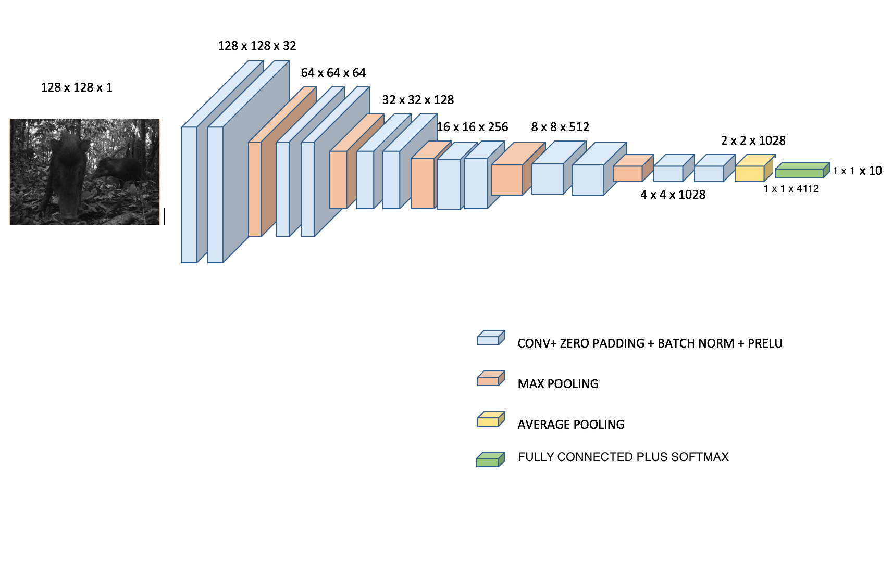

 <h3 style="color:#ff6600 ; text-align:center ; font-family: Verdana, serif; font-style:italic"><b>Classfication of Camera-Trap Images of Wild Animal Species using Convolutional Neural Network</b></h3>

***This work showcases my the capstone project for the Masters program in Data Science at GalvanizeU and University of New Haven . The project uses the data, camera trap images, made available at <a href="http://www.teamnetwork.org">Tropical Ecology Assesment and Monitoring Network(TEAM)</a> in partnership with <a href="http://www.conservation.org/projects/Pages/TEAM-Network-An-early-warning-system-for-nature.aspx">Conservation International</a>. The objective of this work was to build an image classification system for camera-trap images of wild animals. The dataset consisted of 14,125 images from 10 classes. The classes are species of large land animals from Africa and South America. Deep Convolutional. Neural Networks (CNN) were used and different augmentations were explored such as dropout and batch normalization. ***

***Deep Convolutional Neural Networks were used because of their superior performance in Image classification. A few examples are the networks constructed to win the Imagenet challenge such as AlexNet, VGGNet, and more recently DenseNet***

***A deep network was constructed accepting input of image dimensions of 128 x 128 with one channel (grayscale images). The network was constructed by following <a href="http://cs231n.stanford.edu/">Karpathy's tutorial</a>*** 

***The architecture was deep and homogenous with a convolutional layer followed by zero padding, batch normalization, Parametric Rectified Linear Unit (PReLU) activation function and max-pooling layer, in that order. The last activation in the layer was followed by Average Pooling instead of a Max-Pool layer. The architecture has 12 convolutional layers and 1 fully connected layer at the end. The last activation was a Softmax layer to for the 10 classes in the dataset. Fig. below shows the architecture the network.***

***The images were all in jpeg format and the labels or classes were the corresponding folder names inside which the images were stored. The reason for storing the data this way was because the API used for building the CNN is Keras. Keras provides easy definition of data and usage. The API provides the flexibility of using the path in which the data is stored in the program and the model trains by fetching the image from the path. Keras uses the folder names as labels. The images were a mix of grayscale and color images. The images were converted to grayscale to establish a common baseline for the images. ***
